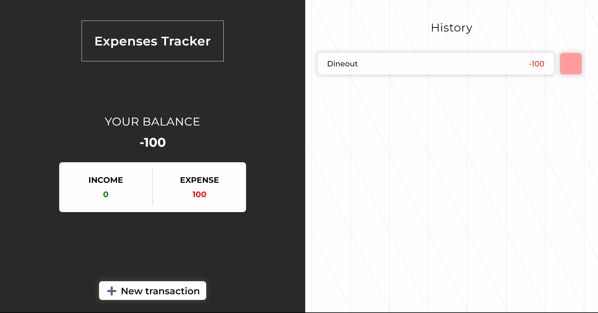
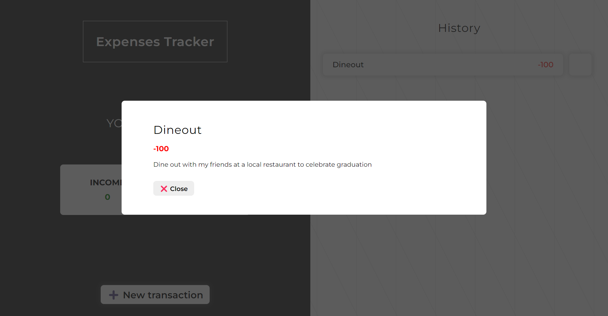
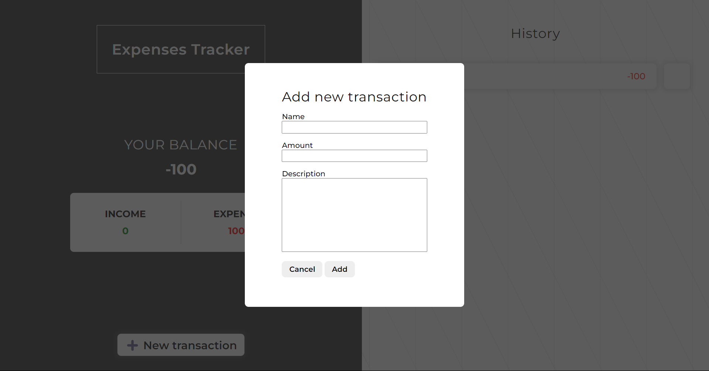

Vanilla JS Expense Tracker
==========================

A responsive, state-managed expense tracker application built with Vanilla JavaScript, HTML, and CSS. This fun side project is designed to play around with core web technologies without the use of any frameworks or libraries.

Link to website: https://nghuuphuong-expensestracker.netlify.app/

Features
--------

-   Add, edit, and delete transactions
-   Display transaction history with income and expense amounts
-   Calculate total income, expense, and balance
-   Save transaction data to localStorage
-   Responsive design for multiple screen sizes
-   Pop-up detail view for individual transactions
  
Setup and Installation
----------------------

1.  Clone the repository:

bashCopy code

`git clone https://github.com/your-username/vanilla-js-expense-tracker.git`

1.  Change directory to the project folder:

bashCopy code

`cd vanilla-js-expense-tracker`

1.  Open the `index.html` file in your favorite web browser.

Usage
-----

1.  Click the "Add Transaction" button to open the create transaction pop-up.
2.  Enter the transaction name, amount, and description, then click "Add" to save the transaction.
3.  The transaction will be added to the list, and the total balance, income, and expense will be updated accordingly.
4.  Click on a transaction to view its details in a pop-up window.
5.  To delete a transaction, click the delete icon next to the transaction in the list.

Technologies Used
-----------------

-   HTML
-   CSS
-   JavaScript
-   localStorage